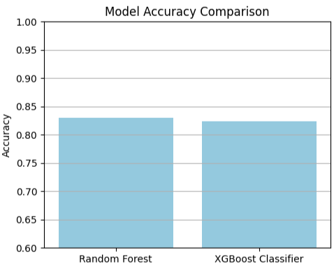
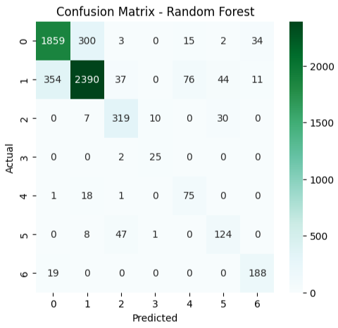
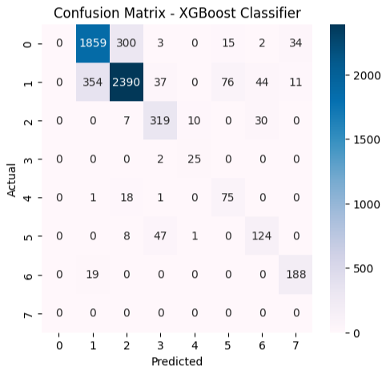
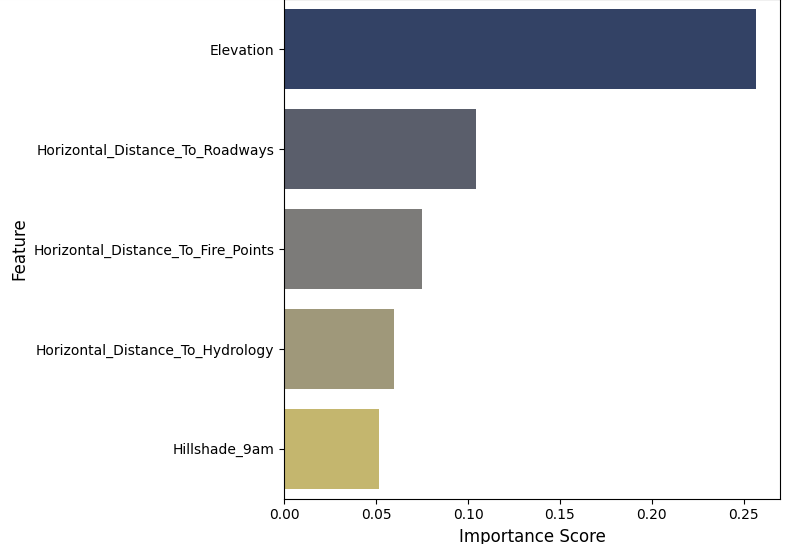
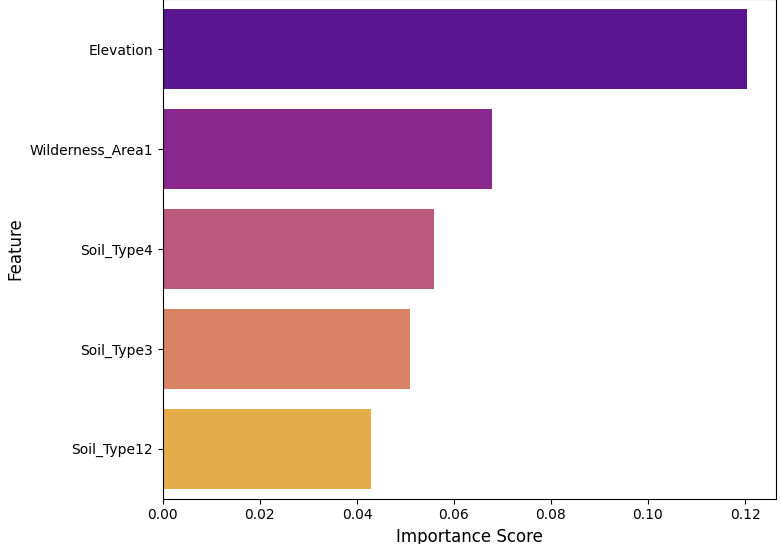

# 🌳 Forest Cover Type Classification
The goal is to build machine learning models that can **predict forest cover type** based on cartographic and environmental features from the **Covertype dataset (UCI Machine Learning Repository)**.
This project is part of my **Remote ML Internship at Elevvo Pathways (Level 2 – Task 3)**.

# 📂 Dataset
- **Source:** https://www.kaggle.com/datasets/uciml/forest-cover-type-dataset
- **Content:** This dataset includes information on tree type, shadow coverage, distance to nearby landmarks (roads etcetera), soil type, and local topography

# ⚙️ Tools & Libraries
- **Python** – main programming language  
- **Pandas, NumPy** – data handling and preprocessing  
- **Scikit-learn** – machine learning models, train/test split, evaluation metrics  
- **XGBoost** – gradient boosting classifier  
- **Matplotlib, Seaborn** – data visualization
- **Imbalanced-learn (SMOTE)** - to balance class distribution

# 📈 Accuracy Results:

-----------------------------------
| Model                | Accuracy |
|----------------------|----------|
| Random Forest        | 0.83     |
| XGBoost              | 0.82     |
-----------------------------------

# 🔹 Confusion Matrix - Random Forest 🌲

# 🔹 Confusion Matrix - XGBoost 🔮

# 🔹 Feature Importance - Random forest 🌲

# 🔹 Feature Importance - XGBoost 🔮

